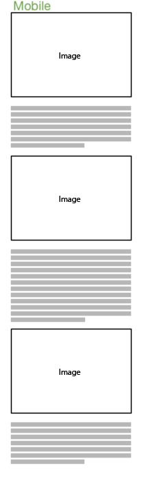
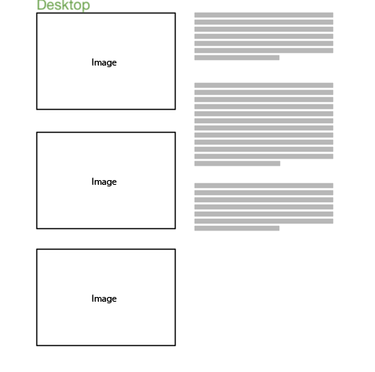

# Impossible CSS layout

The goal is to have a mobile and desktop version of a layout like this:

## Description

In mobile it alternates between one image and one or more paragraphs of text. The desktop version stacks all the images, top against bottom, on the left and all the text, top against bottom, on the right.

There should not be varying gaps between the images or paragraphs. If the length of a paragraph increases it should not affect the spacing of the images etc. The two columns of content are independant in desktop, the text and images can grow and shrink independantly of eachother.

Any technology is fair game. Start from the template site and find the simplest way of achiveing the desired result.

# Solutions

Check out the [starter](starter/)  
[Jonas' solution](Jonas/)  
[Hannes' solution](Hannes/)  
[Tomas' solution](Tomas/)
