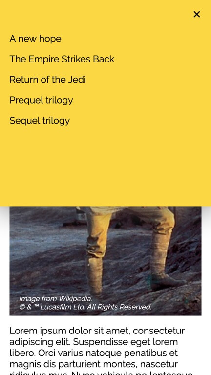
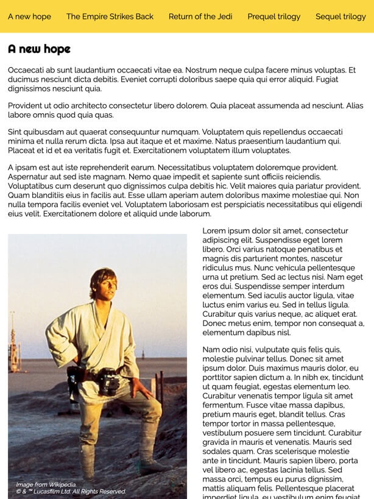
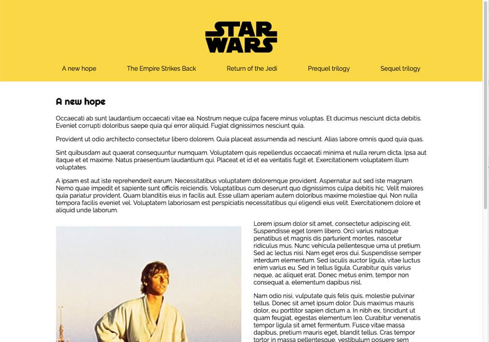

# Responsive HTML menu
Web page menues needs to be responsive to support everything from narrow mobile screens, tablets, wide desktop screens as well as splitted browser windows on desktops. Your task today is to build a responsive HTML web page menu that is placed in the page header. It should be responsive down to a 320px wide screen. Breakpoints is up to you, but should follow the rest of the breakpoints on a fictive page.

# Mobile

# Tablet

# Desktop

