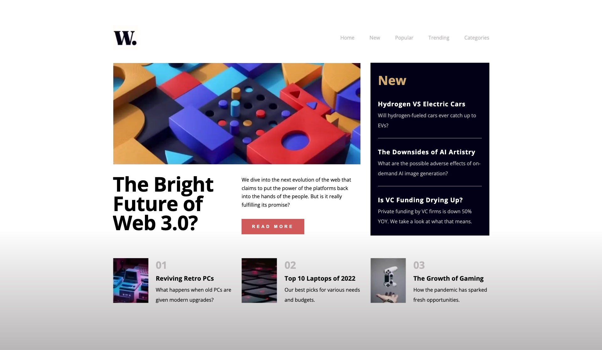

# Your mission


Create this design in as many ways as possible. That is, using as many ways to layout the page as you can. The design doesn't have to be 100% pixel perfect, the goal is to find different ways to achieve the same result.

# Structure

Say you want to create a new layout based on CSS Grid. Copy the starter into your folder under a descriptive name, like `grid`. Edit index.html and main.css to achive the layout.

When you feel you are done you can start again wit a new copy of the starter for the next attempt.

When you are done you should have added something like this to the repo:

```text
Jonas/
  grid/
    index.html
    css/
      main.css
      base.css
    img/
      finished.jpg
      logo.png
      ...
  flex/
    index.html
    css/
      main.css
      base.css
    img/
      finished.jpg
      logo.png
      ...
  ...
```

and so on...

Good luck.
