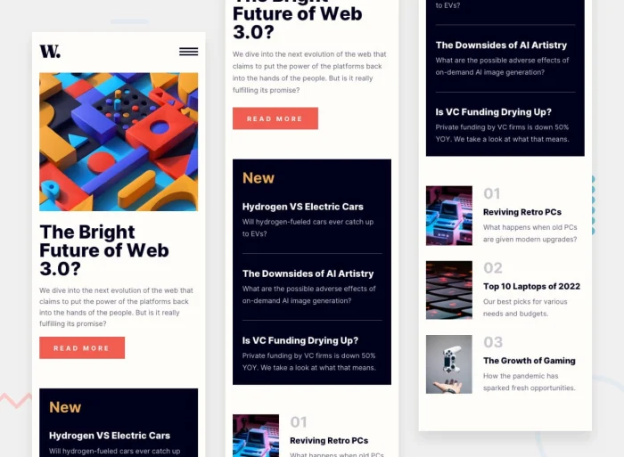

# Mobile adaptation

This week we are picking up the design from last week, but turning it into a mobile version. We will be using the same design, but we will be using a different layout.

The goal is to create a breakpoint that uses the grid template areas to create a mobile version of the design.

Copy the starter and take it from there.
